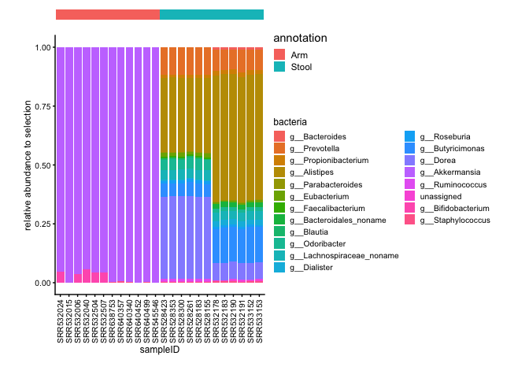
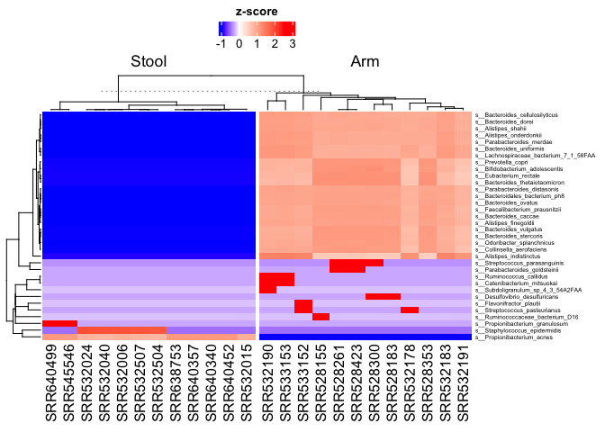

<!-- README.md is generated from README.Rmd. Please edit that file -->

# Wham

<!-- badges: start -->
<!-- badges: end -->

R package allowing for exploratory analysis of metagenomics and
metatranscriptomic data. Includes visualization and statistical analysis
on the functional pathway and taxonomic abundance. This package is
developped based on package ALDEx2.

## Installation

You can install the released version of Wham from
[CRAN](https://CRAN.R-project.org) with:

``` r
install.packages("Wham")
```

## Example

A basic example: you can make differential analysis on metagenomic
sequencing taxonomic and functional output.

``` r
library(Wham)
dir.data <-  system.file("extdata","biobakery_sample_input.tsv",package = "Wham")
countData <-  read.delim(dir.data)
countData <- countData[1:2000,] #we subset the count table to reduce computational cost, 

dir.meta = system.file("extdata","biobakery_sample_metadata.csv",package = "Wham")
metadata <- read.csv(dir.meta,row.names = 1)


 wham_bbk <-  WhamBiobakery(countData = countData,
                         colData = metadata,
                         DE = "taxa",  ##required,choose taxa or feautre(gene family)
                         design = ~ Location,    ##design formula to let function conduct tests on the group of interest,
                         taxa.level = "s",  ##collapse the bacterial rank level when choosing DE as "taxa", default:"s"("speices")."otu" when analyze 16s,
                         contrast = c("Location","Stool","Arm")  ##specify the comparison of interest: Stool(numerator) vs Arm(denominator) in 'Location' variable in metadata.
                         )
```

You can also generate plots, for example:


